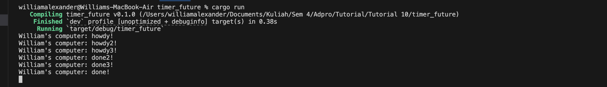
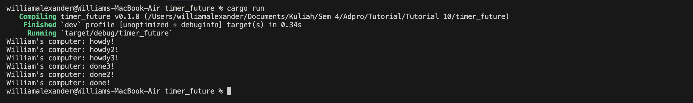
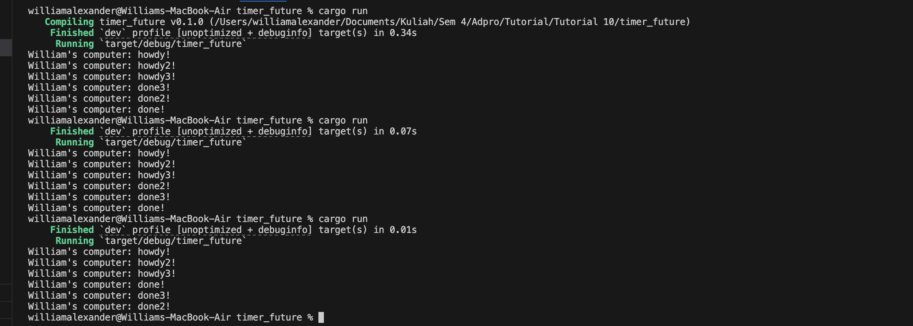

Kode synchronous seperti `println!("William's computer: hey hey");` dieksekusi langsung oleh thread utama tanpa menunggu eksekutor, setelah semua kode synchronous selesai dijalankan, barulah `executor.run()` mulai memproses task asynchronous. 

### Multiple spawn
##### Undrop spawner

Pada console ketika spawner diundrop, program tidak berhenti. Hal ini dikarenakan executor terus menunggu task baru untuk datang. Karena pada program kita, tidak ada lagi task yang datang, jadi program tidak pernah berhenti.

##### Setelah drop spawner lagi

Ketike spawner didrop lagi, program berhenti ketika sudah mencetak ketiga perintah done. Meskipun terlihat bahwa drop spawner diperlukan pada program ini, namun pada kasus tertentu spawner tidak perlu didrop jika kita tidak yakin apakah semua task sudah selesai. Sebagai contoh, dalam aplikasi web yang terus-menerus menunggu data dari API eksternal secara asinkron, proses tersebut mungkin memakan waktu yang tidak pasti sehingga kita tidak dapat mendrop spawner terlalu cepat. 

##### Run berulang kali

Pada output di console tersebut, setelah percobaan beberapa kali merun programnya, urutan howdy selalu sama (1,2,3) namun urutan done berbeda beda. Hal ini dikarenakan tidak ada jaminan task mana yang akan diproses lebih dulu oleh executor, maka urutan bisa berbeda beda setiap kali program dijalankan
