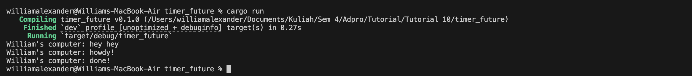

Kode synchronous seperti `println!("William's computer: hey hey");` dieksekusi langsung oleh thread utama tanpa menunggu eksekutor, setelah semua kode synchronous selesai dijalankan, barulah `executor.run()` mulai memproses task asynchronous. 